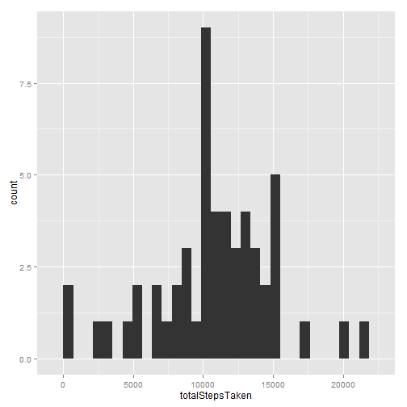
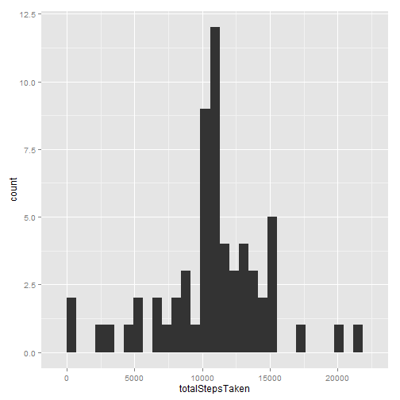
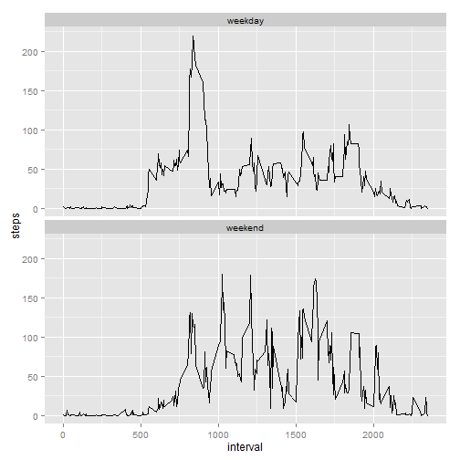

---
title: "Peer Assesment 1"
author: "BeVa"
date: "Monday, May 01, 2015"
output: html_document
---


# Introduction

For this  assignment I have made use of dataser from a personal activity monitoring device provided by the instructor and downloaded from github to my computer. The dataset has three variables:


- steps: Number of steps taking in a 5-minute interval (missing values are coded as NA)

- date: The date on which the measurement was taken in YYYY-MM-DD format

- interval: Identifier for the 5-minute interval in which measurement was taken

I have used R packages 'todyr', 'dplyr', 'ggplot2', and 'magrittr' to process and pre-process the data .

The dataset had a total of 2,304 missing values. I have imputed those values using the mean of total steps taken by interval. To do so, I have followed these steps:

- group the data by 5-minutes interval
- compute the mean on those intervals
- use the computed mean where  there is a NA, or use the real mean otherwise, storing all these values in a vector
- create a new data frame where the  vector created above is the new 'steps' variable, and adding the existing variables 'date' and 'interval'


## Findings

- The mean of the total number of steps taken per day is 10,766.19 and the median is 10,765.00. The maximum number of steps that have been taken, in average, in the 5-minutes interval is in the interval number 835.
- After imputing missing data, I have obtained a mean of 10,765.64 and a median of 10,762.00. These results are very closed to the values previously estimated. In the present activity, imputing data seems to have had  none impact on the estimates of the averages of total daily number of steps, despite the fact that the total daily number of steps have increased. 
- Finally, the total number of steps taken increased on average during the weekend w.r.t the weekdays. On weekends the mean is 41.9, while during the week is 36.6. More free time, more steps taken.


# Analysis and procedures


## Preprocesing the data


```r
#loading needed packages
library(tidyr)
library(dplyr)
library(ggplot2)
library(magrittr)
```

Loading and preprocesing the data


```r
actividad<-  'd:/steps/data/activity.csv' %>%
        read.csv(header=TRUE) %>%
        tbl_df %>%
        mutate(date = as.Date(date))
```


## Calculating the mean of total steps taking per day


```r
# getting rid of NA's, calculting the total number of steps taken per day & mean
actividadnNa<-
        actividad %>% na.omit(.) %>%
        group_by(date) %>%
        summarize(totalStepsTaken = sum(steps), avgSteps = mean(steps))
        
# histogram of total number of steps taken per day
qplot(totalStepsTaken, data=actividadnNa, geom='histogram')
```

 

```r
# mean and median
actividadnNa$totalStepsTaken %>% {c(mean(.), median(.))}
```

```
## [1] 10766.19 10765.00
```

## Average daily activity pattern


```r
#Average daily activity pattern


stepsG <- actividad %>% na.omit() %>%
        group_by(interval) %>%
        summarize(steps = sum(steps)) %>%
        arrange(desc(steps)) 
      

#interval with maximum number of steps
stepsG[1,]
```

```
## Source: local data frame [1 x 2]
## 
##   interval steps
## 1      835 10927
```

```r
ggplot(stepsG, aes(interval, steps)) +
        geom_line(stat='summary', fun.y=mean)
```

 

3. Imputing missing values.
To impute missing values, I goint to:
* group the data by 5-minutes interval
* compute the mean on those intervals
* use the computed mean where there is a NA or used the real mean otherwise, storing all thes values in a vector
* create a new data frame where the above vector is the new 'steps' variable, adding 'date' and 'interval'


```r
#number of NAs
actividad %>%
        {sum(is.na(.))}
```

```
## [1] 2304
```

```r
# averaging by interval
actividadImputed <-actividad %>%
        group_by(interval) %>%
        mutate(imputado = mean(steps, na.rm=TRUE))

#imputing values
imputacion<-ifelse(is.na(actividadImputed$steps), actividadImputed$imputado, 
                 actividadImputed$steps)

#new data frame
nuevo<-tbl_df(data.frame(steps =round(imputacion), actividad[,2:3]))

nuevoImp<-nuevo %>%
        group_by(date) %>%
        summarize(totalStepsTaken = sum(steps))

qplot(totalStepsTaken, data= nuevoImp, geom='histogram')
```

 

```r
# mean and median
nuevoImp$totalStepsTaken %>% {c(mean(.), median(.))}        
```

```
## [1] 10765.64 10762.00
```

## Weekdays and weekend patterns

```r
# adding weekdays and weekend as factors
nuevoWd <- nuevo %>%
        tbl_df() %>%
        mutate(days = as.factor(weekdays(date)),
               seguDia = {ifelse(days == 'sabado' | days == 'domingo',
                        'weekend', 'weekday')}, 
                        seguDia =as.factor(seguDia)) %>%
        select(steps, seguDia,interval)

# actually, we will have two means, one for weekdays and another for weekends
paraGrafico<-nuevoWd %>%
        group_by(seguDia) %>%
        mutate(stepsMean = signif(mean(steps)), 4) 
        
table(paraGrafico$stepsMean)
```

```
## 
## 36.6875 41.9731 
##   15264    2304
```

```r
#using ggplot to directly calculate the mean
ggplot(paraGrafico, aes(interval, steps)) +
        geom_line(stat='summary', fun.y=mean)+ 
        facet_wrap(~seguDia, ncol=1)
```

 


